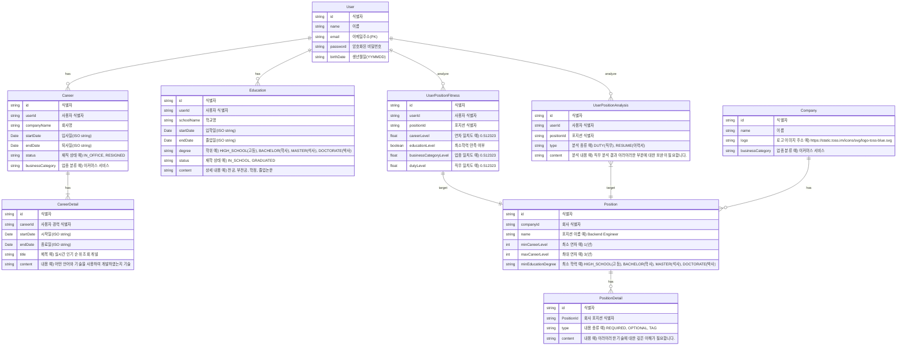

## Description
- 이력서, 구인 공고를 비교 분석하여 취업 컨설팅을 해주는 서비스를 개발 중이고 아직 진행 중입니다.
- 본 저장소는 서비스 일부인 백엔드 코드만 포함되어 있고, 추후 AI 를 연동하여 완성할 예정입니다.
- 제공하는 API 는 아래와 같고 http://localhost:3000/swagger 에서 확인할 수 있습니다.


## Installation

```bash
$ yarn install
```

## Running docker-compose

```bash
$ docker-compose up -d
```

## Running the app

```bash
# development
$ yarn run start

# watch mode
$ yarn run start:dev

# production mode
$ yarn run start:prod
```


## ERD

