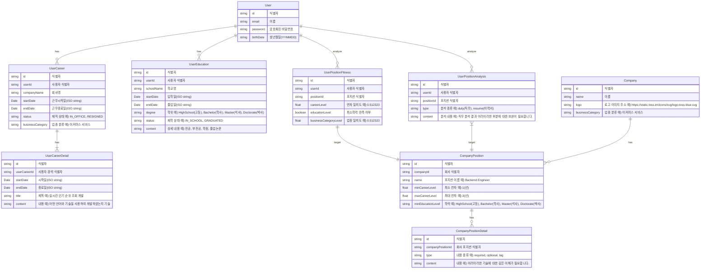

## Description
- AI 기반 취업 컨설팅 백엔드 저장소
- Node.js, MySQL/TypeORM

## Installation

```bash
$ yarn install
```

## Running the app

```bash
# development
$ yarn run start

# watch mode
$ yarn run start:dev

# production mode
$ yarn run start:prod
```


## ERD

